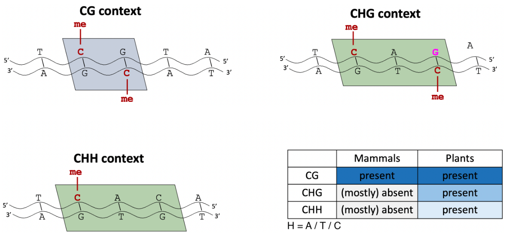
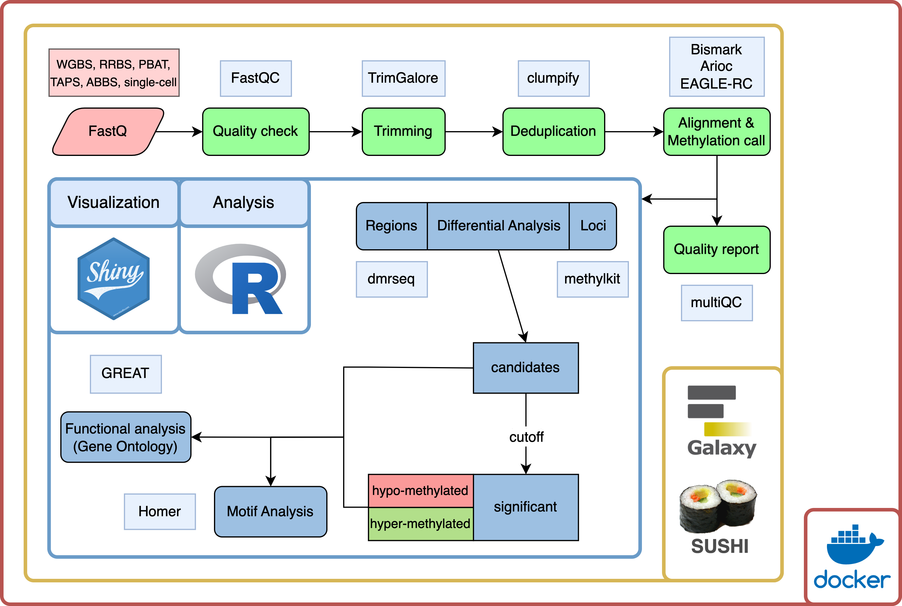
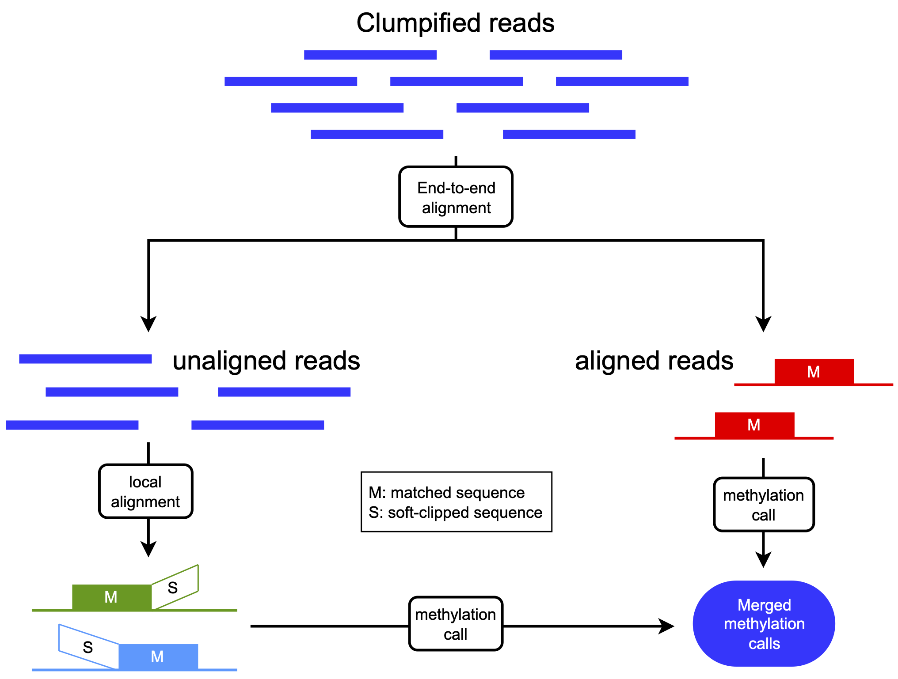
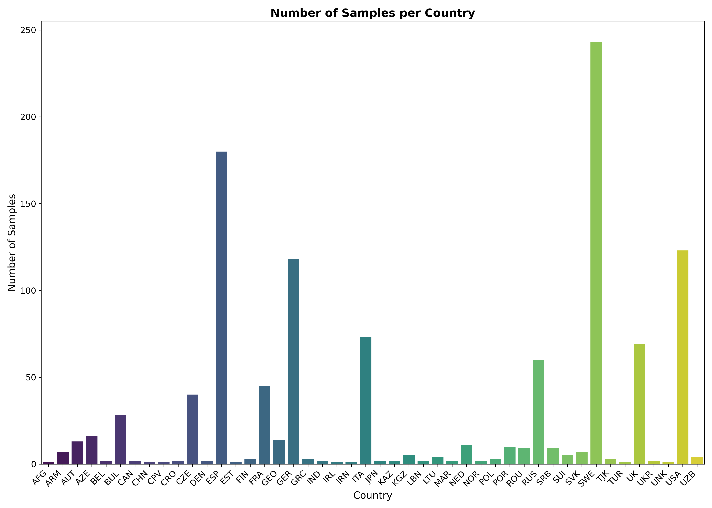
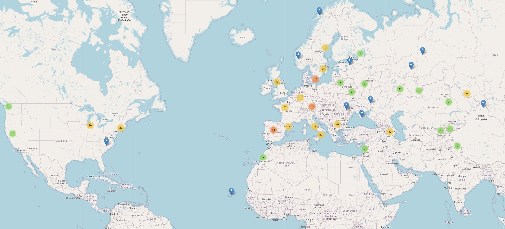
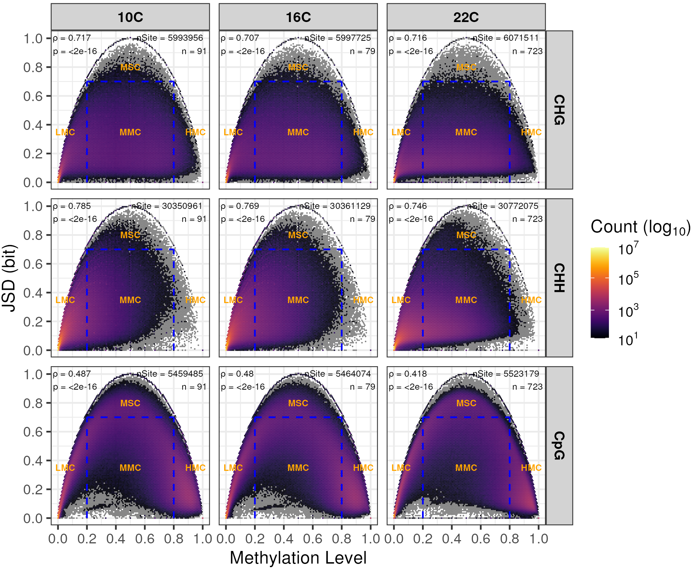
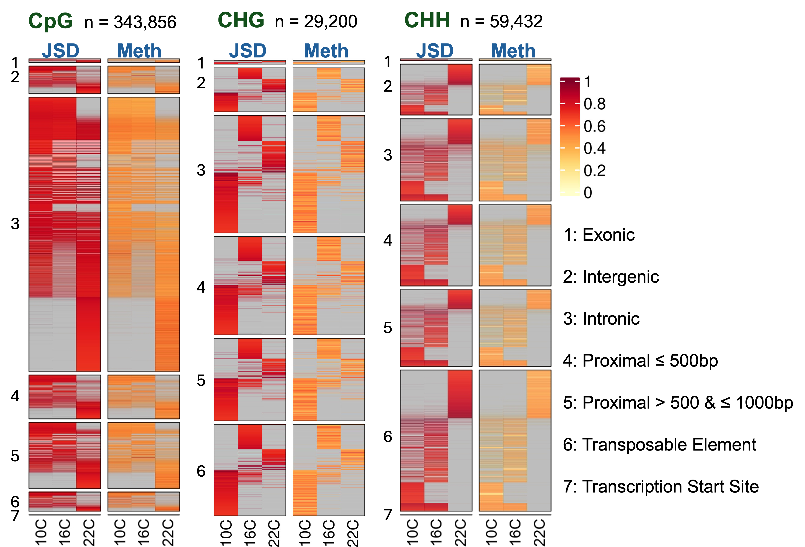

```{=html}
<style>
.mybreak {
   break-before: column;
}
</style>
```
```{=html}
<style>
.ref-align {
  text-align: left
}
</style>
```
```{=html}
<style>
img {
  display: block;
  margin-top: -7px; /* Adjust this value as needed */
}

.my-image {
  margin-top: -1px; /* Adjusted value for a specific image */
}
</style>
```
```{=html}
<style type="text/css">
    .brsmall {
        display: block;
        margin-bottom: .3em;
    }
    .brxsmall {
        display: block;
        margin-bottom: .4em;
    }
    .brsmallneg {
        display: block;
        margin-bottom: -.4em;
    }
    .brconclusion {
        display: block;
        margin-bottom: .8em;
    }
</style>
```
```{css, echo=FALSE}
div.logo_left{
  width: 20%;
}
div.poster_title{
  width: 70%;
}
```

```{r, include=FALSE}
knitr::opts_chunk$set(echo = FALSE,
                      warning = FALSE,
                      tidy = FALSE,
                      message = FALSE,
                      fig.align = 'center',
                      strip.white = T,
                      out.width = "100%",
                      fig.show='asis')
options(knitr.table.format = "html") 
library("knitr")
library("readxl")
library("kableExtra")
library(stringr)
# library(EML)
```

```{r, include=FALSE}
knitr::write_bib(c('posterdown', 'rmarkdown','pagedown'), 'packages.bib')
```

```{r, include=FALSE}
library(stringr)
fix_wrap_kable <- function(kbl) {

  kbl <- kbl %>% 
    str_remove(paste0("\\\\caption[{].+[}]\\n")) %>% # Removes the first caption
    str_replace("\\\\end[{]tabular[}]",
                paste0("\\\\end{tabular}\n\\\\caption{",attributes(kbl)$kable_meta$caption %>% # Adds the new caption using the string supplied in the kable 'caption' argument.
                # The '{0,100}' is just a hack around lookbehind needing a set length, so the function will not work if the table label is longer 
                         str_replace("(?<=[(]\\\\#.{0,100})[)]","}") %>% # Fixes and issue with pandoc syntax being mixed with LaTeX 
                         str_replace("\\label[{]|[(]\\\\#","\\\\\\\\label{"),"}\n")) %>% # Adds an appropriate amount of backslashes before "\label"
    set_attributes(attributes(kbl)) # Ensures that the returned object is still a kable
  
  attributes(kbl)$kable_meta$caption <- NA # Removes the caption from the metadata
  
  return(kbl)
}
```

# Introduction

DNA cytosine methylation is the addition of a methyl group to a cytosine
in the DNA. It impacts transcription and therefore plays a major role in
several vital processes. In mammals, DNA cytosine methylation
predominantly occurs in CG sequence contexts. In plants, in addition to
the CG context, the CHG and CHH contexts are common as well.

<figure>
<center>


<figcaption><b>Figure 1:</b> Methylation contexts in mammals and
plants.</figcaption>

</center>
</figure>

```{r methylationcontexts, include=F, fig.cap="Methylation contexts in mammals and plants.", out.width="80%"}
# knitr::opts_chunk$set(echo = FALSE,
#                       warning = FALSE,
#                       tidy = FALSE,
#                       message = FALSE,
#                       fig.align = 'center',
#                       out.width = "60%")

```


# Aims of the project
**Aim 1: Develop a tool for comprehensive analysis of DNA methylation data:**
Create a comprehensive DNA cytosine methylation analysis framework that combines user accessibility, reproducible workflows, and interactive data visualization capabilities to streamline methylation

**Aim 2: Investigate how temperature affects DNA methylation and gene expression in _Arabidopsis thaliana_:**
Using Methylator, analyze the genome-wide DNA methylation patterns and corresponding gene expression changes in response to temperature variations in *A. thaliana*

# Methylator

## Data analysis framework
Here we introduce `Methylator`, a user-friendly tool for a full DNA cytosine methylation analysis, with an easy-to-use interface, facilitated reproducibility and interactive visualizations of results.

<figure>
<center>



<figcaption><b>Figure 2:</b> Overview of `Methylator`</figcaption>

</center>

</figure>

```{r pipeline, include=F, fig.cap="Overview of the DNA methylation analysis pipeline", out.width="100%"}

```


## Dirty-Harry for aligment of methylation data

Bisulfite treatment of DNA results in a decreased sequence quality, which deteriorates mapping efficiency. Overall, this causes loss of a big proportion of the sequencing data for analysis. The Dirty Harry method offers an improvement to the mapping rate by remapping the unaligned reads locally. Through that, this method increases the mapping efficiency and retains a considerable amount of cytosine sites, which would otherwise be lost.

<figure>
<center>


<figcaption><b>Figure 3:</b> Dirty Harry alignment method. Adapted from [@Wu2019] </figcaption>
</center>
</figure>


# Methylator's application

## Datasets

<div style="position: relative; width: 100%;">
  
  
</div>

<figcaption><b>Figure 4:</b> Dataset distribution (top-left) and sample count per country for the 1001 Arabidopsis Epigenomes Project</figcaption>


```{r dataset_distribution, include=F, fig.cap="Dataset distribution (top-left) and sample count per country.", out.width="80%"}


```

## Jensen-Shannon Divergence calculation

Jensen-Shannon Divergence (JSD) measures the similarity between probability distributions, providing a symmetric comparison of datasets. 
In DNA methylation analysis, JSD can be used to compare methylation patterns across samples, identifying regions with significant epigenetic differences [@Kartal2020].


$$D(\{P_j\}) = H\left(\sum_j \pi_j P_j\right) - \sum_j \pi_j H(P_j)$$

$$H(P_j) = -\sum_k P_{jk} \log_b P_{jk}$$

# Results

## Comparison of `Methylator` with existing tools

<style>
.table>tbody>tr>td{
  padding: 1px; border: hidden;
}
</style>


```{r toolcomparisontable, fig.cap="Comparison to features of popular tools. GUI = graphical user interface. CLI = command line interface. DMR/DML/DMG = Differentially Methylated Regions/Loci/Genes. GO = Gene Ontology"}
# knitr::opts_chunk$set(echo = FALSE,
#                       warning = FALSE,
#                       tidy = FALSE,
#                       message = FALSE,
#                       fig.align = 'center',
#                       out.width = "40%")

# tool_comparison_table <- read_xlsx("figures/Pipelines_comparison.xlsx", sheet = 2)
tool_comparison_table <- read.csv("figures/Pipelines_comparison_09092024.csv")


# colnames(tool_comparison_table)[1] <- ""
tool_comparison_table <- data.frame(lapply(tool_comparison_table, gsub, pattern = "\\<T\\>", replacement = "<h3>&#10003; </h3>"))
tool_comparison_table <- data.frame(lapply(tool_comparison_table, gsub, pattern = "\\<F\\>", replacement = "<h3>&#10005; </h3>"))
# tool_comparison_table <- data.frame(lapply(tool_comparison_table, gsub, pattern = "\\<T\\>", replacement = '\\checkmark'))
# tool_comparison_table <- data.frame(lapply(tool_comparison_table, gsub, pattern = "\\<F\\>", replacement = '\\checkmark'))

# colnames(tool_comparison_table)[1] <- ""
rownames(tool_comparison_table) <- tool_comparison_table[,1]
tool_comparison_table <- tool_comparison_table[,-1]
colnames(tool_comparison_table)[2] <- "methylseq"
colnames(tool_comparison_table)[5] <- "MethylC-analyzer"
# colnames(tool_comparison_table)[1] <- "<b>Methylator</b>"
tool_comparison_table["Copy number variation analysis", "Methylator"] <- "CNVkit"
# tool_comparison_table[13,1] <- "GO, KEGG, Reactome, user-defined"
tool_comparison_table[4,1] <- "WGBS, RRBS, PBAT, TAPS, ABBS, single-cell"

# stripe_color
# stripe_index

knitr::kable(
  tool_comparison_table, format = "html",
  # caption = "Comparison to features of popular tools. GUI = graphical user interface. CLI = command line interface. DMR/DML/DMG = Differentially Methylated Regions/Loci/Genes. GO = Gene Ontology",
  # caption = "",
  align = "c",
  # booktabs = T,
  escape = FALSE) %>%
  kable_styling(
    # bootstrap_options = c("striped", "condensed"),
    # bootstrap_options = c("condensed", "bordered"),
    font_size = 23
  ) %>%
  row_spec(0, bold = T, extra_css = "border-bottom: 0px solid") %>%
  row_spec(seq(1,nrow(tool_comparison_table),2), background="#CCE5FF") %>%
  # row_spec(16, extra_css = "border-bottom: 3px solid") %>%

  # row_spec(1:nrow(tool_comparison_table), extra_css = "..") %>%
  # row_spec(seq(0,nrow(tool_comparison_table),2), background="#CCE5FF") %>%
  column_spec(1, bold = T)
  # row_spec(16, extra_css = "border-bottom: 3px solid") %>%
  # fix_wrap_kable
  # footnote(general_title = "
  # 
  #          **Table 1:** Comparison with features of popular tools.",
  # general = "GUI = graphical user interface
  #          CLI = command line interface
  #          DMR/DML/DMG = Differentially Methylated Regions/Loci/Genes
  #          GO = Gene Ontology",
  # title_format = "bold")

# knitr::kable(
#   tool_comparison_table, format = "latex",
#   caption = "Comparison to features of common tools. DMRs = Differentially Methylated Regions,
#   DMLs = Differentially Methylated Loci, DMGs = Differentially Methylated Genes",
#   align = "c",
#   escape = FALSE) %>%
#   kable_styling(
#     font_size = 20
#     ) %>%
#   column_spec(1, bold = TRUE)
```

&emsp;&emsp;&emsp;&emsp;&emsp;&nbsp;<b>Table 1:</b> Comparison with features of widely used tools.<br>

<!-- <b>Table 1:</b> Comparison with features of popular tools.<br><br> -->
GUI = graphical user interface, CLI = command line interface<br>
DMR/DML/DMG = Differentially Methylated Regions/Loci/Genes<br>
GO = Gene Ontology

## Temperature effect on DNA Methylation

We analyzed the impact of different temperature conditions (10°C, 16°C, 22°C) on 
DNA methylation in the CHG, CHH, and CpG contexts across various genomic regions.
By calculating the JSD and methylation levels, we revealed distinct patterns of 
methylation context-specific changes across these temperature conditions.


<figure>
<center>



<figcaption><b>Figure 5:</b> Jensen-Shannon Divergence (JSD) as a function of
methylation levels in CHG, CHH, and CpG contexts under three temperature conditions.</figcaption>

</center>
</figure>

We further explored how methylation levels and JSD vary across different genomic
regions, such as exonic, intergenic, and transposable elements, under three temperature conditions 
(10°C, 16°C, 22°C). This analysis aimed to identify regions that are particularly sensitive to 
temperature-induced epigenetic changes. The results could provide a clearer image 
of how genomic context influences methylation patterns and gene regulation in response to environmental stress.

<figure>
<center>



<br>
<figcaption><b>Figure 6:</b> Heatmap comparison of methylation levels (Meth) and JSD across various genomic regions (exonic, intergenic, intronic, etc.) and temperatures (10°C, 16°C, 22°C) in CHG, CHH, and CpG contexts.</figcaption>

</center>
</figure>


# Conclusion

**`Methylator`**: A versatile and sustainable framework for DNA cytosine methylation analysis, supporting plants and mammals, compatible with diverse library preparation methods, and offering interactive result visualizations.

Our findings highlight the role of temperature in shaping DNA methylation patterns across genomic regions, offering insights into context-specific epigenetic responses to environmental stress.

# Funding

- URPP Evolution in Action, University of Zurich
- Faculty of Science, University of Zurich

# Code

**GitHub:** [github.com/urppeia](https://github.com/urppeia)

# References
