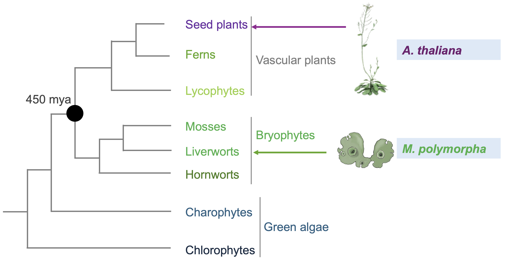
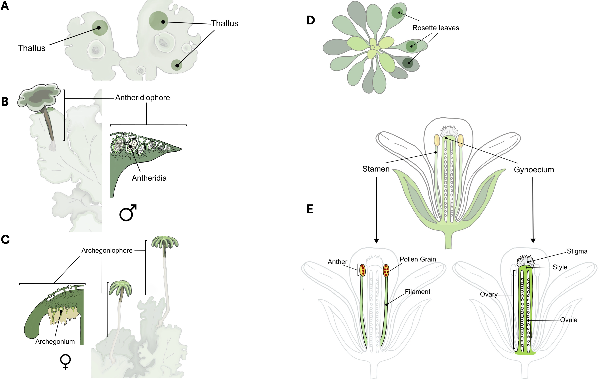
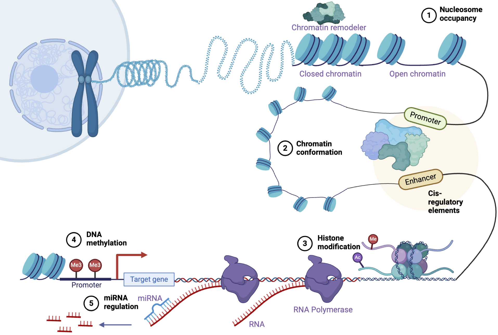
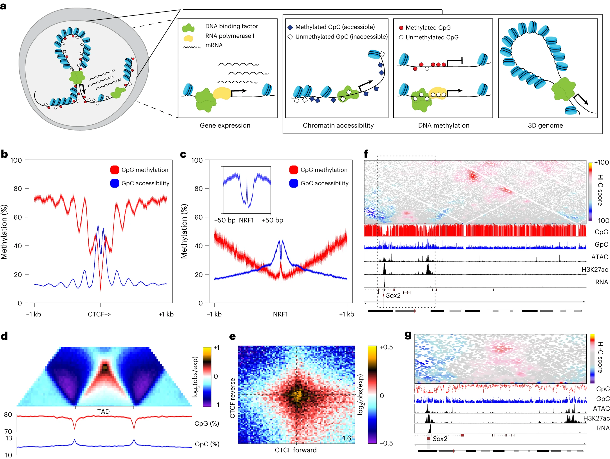
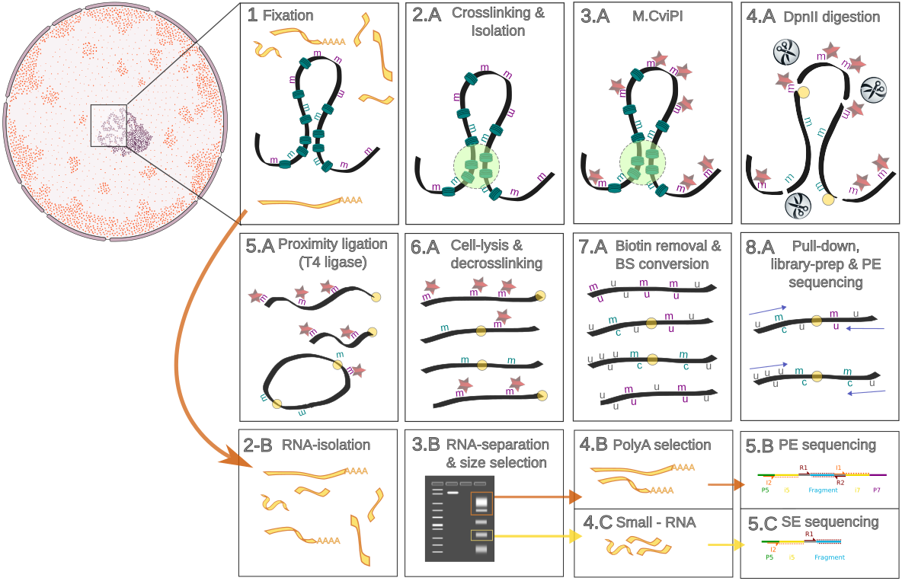
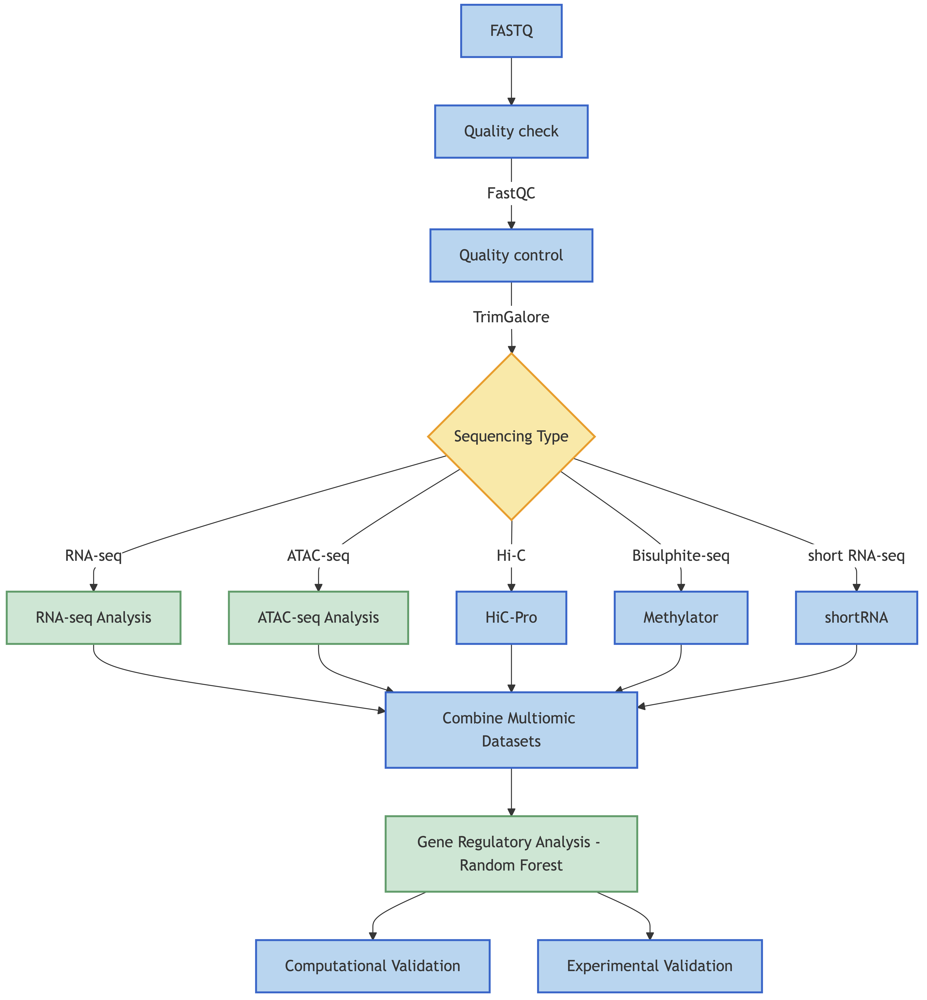
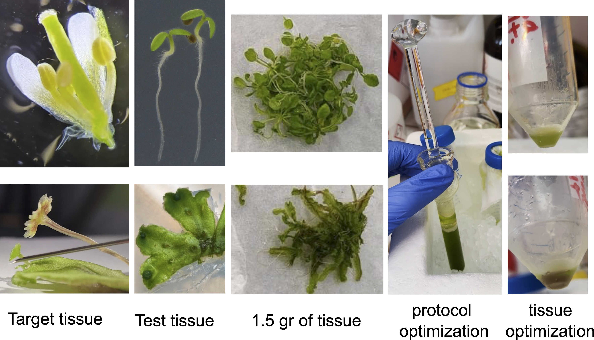

```{css, echo=FALSE}
div.logo_left{
  width: 15%;
}
div.poster_title{
  width: 70%;
}

div.logo_right{
  width: 15%;
}
div.poster_title{
  width: 70%;
}
```

<style>
.mybreak {
   break-before: column;
}
</style>

<style>
.justify-text {
    text-align: justify;
}
</style>

# Introduction

## Key models for understanding land plant development and evolution

_Marchantia polymorpha_ and _Arabidopsis thaliana_, representing members from the opposite spectrum of land plant phylogeny, have become key models for understanding land plant development and evolution.

<figure>
<center>
  
  <br>
  <figcaption class="justify-text">
  **Figure 1:** Simplified phylogenetic tree of major plant clades illustrating their evolutionary relationship.
  </figcaption>
</center>  
</figure>


## _Marchantia polymorpha_ vs _Arabidopsis thaliana_: vegetative to sexual transition

<figure>
<center>

  <br>
  <figcaption class="justify-text">
  **Figure 2:** Target Tissues in *M. polymorpha* and *A. thaliana*. **A**: Vegetative thalli of *M. polymorpha* (male and female). **B,C**: Male and female reproductive tissues of *M. polymorpha*. **D**: Top view of *A. thaliana* rosette leaves. **E**: Cross-section of *A. thaliana* flower, showing stamen (male) and gynoecium (female).
  </figcaption>
</center>  
</figure>

## Genomic and epigenomic methods for studying gene regulatory network

<figure>
<center>
  
  <br>
  <figcaption class="justify-text">
  **Figure 3:** A simplified illustration of transcriptional regulation. **1:** Nucleosome occupancy. **2:** Chromatin conformation. **3:** Histone modifications. **4:** DNA methylation. **5:** Small RNA regulation. _Figure is generated using Biorender [biorender.com](https://www.biorender.com/)_
</figcaption>
</center>  
</figure>

<!-- ... TCCTCTGCTT &emsp;&emsp;&nbsp;&rarr; <font color="red">aligns to multiple locations on the genome</font><br> -->
<!-- &emsp;&emsp;&emsp;&emsp;&emsp;&emsp;&emsp;&emsp;&darr;<br> -->
<!-- ... TCCTCTGCTT**CCA** &nbsp;&rarr; <font color="red">does not align to the genome</font> -->

# Aims of the project

**Aim 1: Generate Comprehensive Genomic and Multi-Omics Datasets**<br>
Collect tissues, adapt 3DRAM-seq for plants, and prepare multi-omics libraries for sequencing.

**Aim 2: Develop and Implement Multi-Omics Data Analysis Tools**<br>
Set up data pipelines and a reproducible platform for analyzing and integrating multi-omics data.

**Aim 3: Uncover Gene Regulatory Networks in _M. polymorpha_ and _A. thaliana_**<br>
Build, compare, and validate gene regulatory networks using multi-omics data across developmental stages and species.

# Methods {.mybreak}

## 3DRAM-seq

<figure>
<center>
  
  <br>
  <figcaption class="justify-text">
  **Figure 4:** 3DRAM-seq profiles 3D genome organization, chromatin accessibility, DNA methylation, and gene expression. **a:** Schematic of 3DsRAM-seq. **b:** CpG methylation and GpC accessibility at CTCF ChIP-seq peaks. **c:** Same as **b** for NRF1 ChIP-seq peaks. **d:** Contact enrichment, DNA methylation, and GpC accessibility at TADs (exp, expected; obs, observed). **e:** Contact enrichment between convergent CTCF motifs; center-to-corner ratio shown. **f:** Contact map and genomic tracks for Sox2 locus (DNA methylation, GpC accessibility, ATAC-seq, H3K27ac ChIP-seq, RNA sequencing). **g:** Magnified view of **f**. Figures **b** - **g** are from [@Noack2023].
  </figcaption>
</center>  
</figure>

## 3DsRAM-seq

<figure>
<center>
  
  <br>
  <figcaption class="justify-text">
  **Figure 5:** 3DsRAM-seq profiles 3D genome organization, chromatin accessibility, DNA methylation, gene expression, and short non-coding RNA expression.
  </figcaption>
</center>  
</figure>


## Overview of the data analysis pipeline

<figure>
<center>
  
  <br>
  <figcaption class="justify-text">
  **Figure 6:** Data analysis pipeline. RNA-seq and ATAC-seq will be analyzed using pipelines from [@tanwar_computational_2022], short RNA-seq will be analyzed by `shortRNA` `R` package [@tanwar_computational_2022], Bi-sulphite-seq data will be analyzed by `Methylator`, and Hi-C data will be analyzed using `HiC-Pro` [@Servant2015].
  </figcaption>
</center>  
</figure>


## Evaluation of established 3DsRAM-seq

We will compare the datasets generated from 3DsRAM-seq witht the following datasets:

```{r, comparison, echo = FALSE, message=FALSE, warning=FALSE, fig.height=11.5, results='asis', eval=TRUE}
library(gt)
library(dplyr)

sequencing_data <- data.frame(
  Species = c(rep("Arabidopsis thaliana", 4), rep("Marchantia polymorpha", 4)),
  Sequencing = rep(c("WGBS", "RNA-seq", "ATAC-seq", "Hi-C"), 2),
  Tissue = c(rep("Floral", 4), "Apical notch", "Apical notch", "Thallus + Apical notch", "Apical notch /thallus /whole plant"),
  Accessions = c(
    "GSM7049197, GSM7049198",
    "SRP035230",
    "SRR21456840, SRR21456839",
    "GSM4332485, GSM4332485",
    "SRR5314027, SRR5314028, SRR5314029, SRR5314030, SRR5314031, SRR5314032",
    "SRR1553294, SRR1553296, SRR1553295",
    "SRR10879463, SRR10879464",
    "SRR396657, SRR396658"
  )
)

sequencing_table <- sequencing_data %>%
  group_by(Species) %>%
  gt() %>%
  tab_style(
    style = list(
      cell_fill(color = "#e6f3e6"),
      cell_text(weight = "bold", font = "Arial", size = px(52))
    ),
    locations = cells_column_labels()
  ) %>%
  tab_style(
    style = list(
      cell_text(color = "black", weight = "bold", style = "italic", font = "Arial", size = px(48))
    ),
    locations = cells_group()
  ) %>%
  cols_width(
    Sequencing ~ pct(33),
    Tissue ~ pct(33),
    Accessions ~ pct(34)
  ) %>%
  tab_options(
    table.width = pct(100),  # Make table fill available width
    table.font.name = "Arial",
    table.font.size = px(25),
    table.font.color = "black"
  )

sequencing_table
```
<figcaption class="justify-text">
  **Table 1:** Datasets that will be used for validating 3DsRAM-seq.
</figcaption>

# Preliminary results

<figure>
<center>
  
  <br>
  <figcaption class="justify-text">
  **Figure 7:** Experimental setup for tissue analysis, featuring tissue collection and protocol optimization steps. The workflow involves using 1.5 grams of starting tissue from test samples which will require further optimization in the experimental conditions for the target sample analysis. Depending on organisms or harvested tissue, the protocol will require further specific adaptations.
  </figcaption>
</center>  
</figure>


# Conclusions

- 3DsRAM-seq, an adaptation of 3DRAM-seq for plants, profiles 3D genome organization, chromatin accessibility, DNA methylation, gene expression, and small RNA expression.
- The method will profile 3D genome organization, chromatin accessibility, DNA methylation, gene expression, and small RNA expression in *M. polymorpha* and *A. thaliana* tissues, capturing comprehensive multi-omics data.
- Most of the individual techniques within the 3DsRAM-seq workflow have been previously optimized for plant systems, suggesting that this approach should be feasible for the target samples. The main experimental challenges lie in optimizing the plant-specific conditions, including tissue composition and the precise amount required for successful implementation.
- The data generated from 3DsRAM-seq will be compared and validated against existing datasets, such as WGBS, RNA-seq, ATAC-seq, and Hi-C data, to establish the reliability of the new method.
- If successful, the parallel multi-omics data will enable comparative analysis of gene regulatory networks in the two plant species using machine learning, providing insights into the development and evolution of plant reproduction.

# Funding

This project is supported by URPP Evolution in Action pilot project grant.

# Code

**GitHub:** [urppeia/3DsRAM-seq](https://github.com/urppeia/3DsRAM-seq)

# References